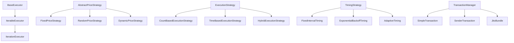

# @solana-kit-bot/core

<div align="center">


**Core framework cho Solana Kit Bot - Hệ thống executor và quản lý giao dịch
Solana với TypeScript**

[Tài liệu](#-tài-liệu) • [Cài đặt](#-cài-đặt) • [Sử dụng](#-cách-sử-dụng) •
[API](#-api-reference) • [Ví dụ](#-ví-dụ)

</div>

## 📖 Tổng quan

`@solana-kit-bot/core` là package cốt lõi của Solana Kit Bot ecosystem, cung
cấp:

- 🔄 **Executor System**: Framework cho việc thực thi lệnh với retry logic và
  timeout
- 🎯 **Strategy Pattern**: Các chiến lược execution, timing, và pricing linh
  hoạt
- 📦 **Transaction Management**: Quản lý giao dịch Solana với Jito bundle
  support
- 📊 **Logging System**: Hệ thống log advanced với màu sắc và timing utilities
- 🛡️ **Type Safety**: TypeScript definitions đầy đủ cho toàn bộ hệ thống
- ⚡ **Performance**: Optimized cho high-frequency trading operations

## 🚀 Cài đặt

```bash
# Với pnpm (khuyến nghị)
pnpm add @solana-kit-bot/core

# Với npm
npm install @solana-kit-bot/core

# Với yarn
yarn add @solana-kit-bot/core
```

## 🏗️ Kiến trúc

### Core Components



### Package Structure

```
@solana-kit-bot/core/
├── abstract/           # Abstract base classes
│   ├── base-executor.ts      # Base executor với retry/timeout logic
│   ├── iterable-executor.ts  # Executor cho repeated tasks
│   └── price-strategy.ts     # Base class cho price strategies
├── executor/           # Concrete executor implementations
│   └── iteration-executor.ts # High-level iteration executor
├── strategies/         # Strategy implementations
│   ├── execution/           # Execution control strategies
│   ├── timing/             # Timing control strategies
│   └── pricing/            # Price calculation strategies
├── types/             # TypeScript type definitions
├── utils/             # Utility functions (math, prompts)
├── logger.ts          # Advanced logging system
├── transaction-manager.ts # Solana transaction management
└── index.ts           # Main exports
```

## 💡 Cách sử dụng

### Quick Start

```typescript
import {
  IterationExecutor,
  createLogger,
  createTransactionManager,
  FixedPriceStrategy,
} from '@solana-kit-bot/core'
import { createProvider } from '@solana-kit-bot/provider'

// 1. Setup logger
const logger = createLogger('MyBot', { level: 'debug' })

// 2. Setup provider và transaction manager
const provider = createProvider({
  rpcUrl: 'https://api.mainnet-beta.solana.com',
})
const txManager = createTransactionManager(provider)

// 3. Tạo custom executor
class MyTradingBot extends IterationExecutor {
  constructor() {
    super({
      interval: 5000, // 5 giây giữa các iteration
      maxIterations: 0, // Chạy vô hạn
      stopOnError: false, // Tiếp tục khi có lỗi
      gracefulShutdown: true,
    })
  }

  async executeIteration(context, iteration) {
    logger.info(`Đang thực hiện iteration ${iteration}`)

    try {
      // Business logic ở đây
      const result = await this.performTrading(context)
      return this.createSuccessResult(`Iteration ${iteration} thành công`)
    } catch (error) {
      logger.error(`Lỗi iteration ${iteration}:`, error)
      return this.createErrorResult(error)
    }
  }

  private async performTrading(context) {
    // Implement trading logic
  }
}

// 4. Chạy bot
const bot = new MyTradingBot()
await bot.execute({ logger, provider, txManager })
```

## 📚 API Reference

### Core Exports

```typescript
// Executors
export { BaseExecutor, IterableExecutor, IterationExecutor }

// Strategies - Execution
export {
  CountBasedExecutionStrategy,
  TimeBasedExecutionStrategy,
  HybridExecutionStrategy,
  IterationExecutionStrategy,
}

// Strategies - Timing
export {
  FixedIntervalTiming,
  ExponentialBackoffTiming,
  AdaptiveTiming,
  ImmediateTiming,
}

// Strategies - Pricing
export {
  AbstractPriceStrategy,
  FixedPriceStrategy,
  RandomPriceStrategy,
  DynamicPriceStrategy,
  SteppedPriceStrategy,
  RandomPercentageStrategy,
}

// Transaction Management
export { createTransactionManager, JITO_TIP_ACCOUNTS, randomTipAccount }

// Logging
export { Logger, createLogger }

// Utils
export {
  ceilDiv,
  floorDiv,
  toBigInt,
  fromBigInt,
  abbreviateNumber,
  wrapEscHandler,
}

// Types
export * from './types'
```

### BaseExecutor

Abstract base class cho tất cả executors:

```typescript
abstract class BaseExecutor implements CommandExecutor<SolanaBotContext> {
  constructor(config: CommandExecutorConfig)

  abstract execute(context: SolanaBotContext): Promise<ExecutorResult>

  // Helper methods
  protected createSuccessResult(message?: string, data?: any): ExecutorResult
  protected createErrorResult(error: Error): ExecutorResult
  protected executeWithRetry<T>(context, operation, retries?): Promise<T>
  protected executeWithTimeout<T>(operation, timeout?): Promise<T>
}
```

### IterationExecutor

High-level executor cho repeated tasks:

```typescript
abstract class IterationExecutor extends IterableExecutor {
  constructor(config: IterationExecutorConfig)

  abstract executeIteration(
    context: SolanaBotContext,
    iteration: number
  ): Promise<ExecutorResult>
}

interface IterationExecutorConfig extends CommandExecutorConfig {
  interval?: number // Thời gian giữa iterations (ms)
  maxIterations?: number // Số iterations tối đa (0 = vô hạn)
  stopOnError?: boolean // Dừng khi có lỗi
  gracefulShutdown?: boolean // Graceful shutdown support
}
```

### TransactionManager

Quản lý giao dịch Solana:

```typescript
interface TransactionManager {
  // Simple transactions
  buildSimpleTransaction(
    instructions: Instruction[],
    feePayer: TransactionSigner,
    minContextSlot?: Slot,
    additionalSigners?: TransactionSigner[]
  ): Promise<Base64EncodedWireTransaction>

  sendSimpleTransaction(
    transaction: Base64EncodedWireTransaction
  ): Promise<string>

  // Sender transactions (với priority fees)
  buildSenderTransaction(
    instructions: Instruction[],
    feePayer: TransactionSigner,
    options?: BuildSenderOptions
  ): Promise<Base64EncodedWireTransaction>

  sendSenderTransaction(
    transaction: Base64EncodedWireTransaction
  ): Promise<string>

  // Jito bundles
  buildBundle(
    bundles: Bundle[],
    tip: bigint
  ): Promise<Base64EncodedWireTransaction[]>
  sendBundle(bundles: Base64EncodedWireTransaction[]): Promise<string>
  sendBundleWithRetry(
    bundles: Base64EncodedWireTransaction[],
    options?: RetryBundleOptions
  ): Promise<string>

  // Confirmation
  confirmTransaction(
    signature: Signature,
    options?: { maxRetries?: number; retryDelay?: number }
  ): Promise<{ confirmed: boolean; err?: Error }>
  checkBundleStatus(bundleId: string): Promise<BundleStatusResult>
}
```

### Logger

Advanced logging system:

```typescript
class Logger {
  constructor(config?: LoggerConfig)

  // Log methods
  error(message: string | Error, meta?: object): void
  warn(message: string, meta?: object): void
  info(message: string, meta?: object): void
  debug(message: string, meta?: object): void

  // Timing utilities
  startTimer(label: string): () => void
  timeAsync<T>(label: string, fn: () => Promise<T>): Promise<T>

  // Configuration
  setLevel(level: LogLevel): void
  getLevel(): string
  isLevelEnabled(level: LogLevel): boolean
}
```

## 🎯 Strategies Deep Dive

### Execution Strategies

Điều khiển khi nào dừng execution:

```typescript
// Dừng sau số lần nhất định
const countStrategy = new CountBasedExecutionStrategy(10, true)

// Dừng sau thời gian nhất định
const timeStrategy = new TimeBasedExecutionStrategy(5 * 60 * 1000, true)

// Hybrid: dừng khi một trong hai điều kiện được thỏa mãn
const hybridStrategy = new HybridExecutionStrategy(
  5 * 60 * 1000, // 5 phút
  10, // 10 iterations
  'or', // mode: 'or' | 'and'
  true // stopOnError
)
```

### Timing Strategies

Điều khiển timing giữa executions:

```typescript
// Fixed interval
const fixedTiming = new FixedIntervalTiming(3000) // 3 giây

// Exponential backoff
const backoffTiming = new ExponentialBackoffTiming(
  1000, // initial delay
  2, // multiplier
  30000 // max delay
)

// Adaptive timing dựa trên success rate
const adaptiveTiming = new AdaptiveTiming(
  2000, // base interval
  10000, // max interval
  0.8 // target success rate
)
```

### Price Strategies

Tính toán giá giao dịch:

```typescript
// Giá cố định
const fixedPrice = new FixedPriceStrategy({ fixedPrice: 0.01 })

// Giá random trong range
const randomPrice = new RandomPriceStrategy({
  minPrice: 0.005,
  maxPrice: 0.02,
  precision: 6,
})

// Giá động dựa trên market
const dynamicPrice = new DynamicPriceStrategy({
  basePrice: 0.01,
  volatilityFactor: 0.1,
  trendSensitivity: 0.05,
})

// Sử dụng
const context = { iteration: 1, timestamp: Date.now() }
const result = await randomPrice.calculatePrice(context)
console.log(`Giá: ${result.price}, Confidence: ${result.confidence}`)
```

## 🎨 Ví dụ

### 1. Simple Trading Bot

```typescript
import { IterationExecutor, createLogger } from '@solana-kit-bot/core'

class SimpleBot extends IterationExecutor {
  private logger = createLogger('SimpleBot')

  constructor() {
    super({
      interval: 10000, // 10 giây
      maxIterations: 100, // Tối đa 100 lần
      stopOnError: false,
    })
  }

  async executeIteration(context, iteration) {
    this.logger.info(`Bắt đầu iteration ${iteration}`)

    try {
      // Kiểm tra thị trường
      const marketData = await this.getMarketData()

      // Quyết định trade
      if (this.shouldTrade(marketData)) {
        await this.executeTrade(context, marketData)
      }

      return this.createSuccessResult(`Iteration ${iteration} completed`)
    } catch (error) {
      this.logger.error(`Iteration ${iteration} failed:`, error)
      return this.createErrorResult(error)
    }
  }

  private async getMarketData() {
    // Implement market data fetching
  }

  private shouldTrade(data) {
    // Implement trading logic
    return true
  }

  private async executeTrade(context, data) {
    // Implement actual trading
  }
}

// Chạy bot
const bot = new SimpleBot()
await bot.execute(context)
```

### 2. Bundle Trading với Jito

```typescript
import {
  createTransactionManager,
  IterationExecutor,
  FixedPriceStrategy,
} from '@solana-kit-bot/core'

class BundleTrader extends IterationExecutor {
  private txManager = createTransactionManager(this.provider)
  private priceStrategy = new FixedPriceStrategy({ fixedPrice: 0.005 })

  async executeIteration(context, iteration) {
    try {
      // Tạo bundle transactions
      const bundles = await this.createTradingBundle(context)

      // Gửi bundle với tip
      const tip = 1000000n // 0.001 SOL
      const bundleTxs = await this.txManager.buildBundle(bundles, tip)
      const bundleId = await this.txManager.sendBundleWithRetry(bundleTxs, {
        maxRetries: 3,
        retryDelay: 2000,
      })

      context.logger.success(`Bundle sent: ${bundleId}`)
      return this.createSuccessResult(`Bundle ${bundleId} sent`)
    } catch (error) {
      return this.createErrorResult(error)
    }
  }

  private async createTradingBundle(context) {
    const priceResult = await this.priceStrategy.calculatePrice({
      iteration: context.iteration,
      timestamp: Date.now(),
    })

    return [
      {
        instructions: await this.createBuyInstructions(priceResult.price),
        payer: context.wallet,
        additionalSigner: [],
      },
      {
        instructions: await this.createSellInstructions(
          priceResult.price * 1.1
        ),
        payer: context.wallet,
        additionalSigner: [],
      },
    ]
  }
}
```

### 3. Advanced Retry Logic

```typescript
class RobustExecutor extends BaseExecutor {
  async execute(context) {
    return this.executeWithRetry(
      context,
      async () => {
        // Operation có thể fail
        const result = await this.riskyOperation()
        return result
      },
      3 // 3 retry attempts
    )
  }

  private async riskyOperation() {
    // Simulate operation that might fail
    if (Math.random() < 0.7) {
      throw new Error('Random failure')
    }
    return 'Success!'
  }
}
```

### 4. Custom Price Strategy

```typescript
import { AbstractPriceStrategy } from '@solana-kit-bot/core'

class MarketBasedPriceStrategy extends AbstractPriceStrategy {
  constructor(private apiUrl: string) {
    super('market-based', { minPrice: 0.001, maxPrice: 1.0 })
  }

  async calculatePrice(context) {
    try {
      // Fetch market price
      const marketPrice = await this.fetchMarketPrice()

      // Apply some logic
      const calculatedPrice =
        marketPrice * (1 + Math.sin(context.iteration) * 0.1)

      return this.createResult(
        calculatedPrice,
        0.8,
        `Market-based price: ${calculatedPrice}`,
        { marketPrice, iteration: context.iteration }
      )
    } catch (error) {
      // Fallback to base price
      return this.createResult(0.01, 0.3, 'Fallback price due to API error')
    }
  }

  private async fetchMarketPrice() {
    const response = await fetch(this.apiUrl)
    const data = await response.json()
    return data.price
  }
}
```

## 🔧 Configuration

### Logger Configuration

```typescript
const logger = createLogger('MyModule', {
  level: 'debug', // 'error' | 'warn' | 'info' | 'verbose' | 'debug' | 'silly'
  enableColors: true, // Bật màu sắc
  moduleName: 'Trading', // Prefix cho logs
})
```

### Executor Configuration

```typescript
const config: CommandExecutorConfig = {
  timeout: 30000, // 30 giây timeout
  maxRetries: 3, // 3 lần retry
  retryDelay: 1000, // 1 giây delay giữa retries
}
```

### Transaction Manager Options

```typescript
// Build sender transaction options
const options: BuildSenderOptions = {
  priorityFeeLevel: 'recommended', // 'recommended' | 'high' | 'medium' | 'low'
  unitLimit: 200_000, // Custom compute units
  unitPrice: 5_000_000, // Custom priority fee (micro-lamports)
  senderTip: 0.001, // Custom sender tip (SOL)
  additionalSigners: [wallet], // Additional signers
}
```

## 🛠️ Math Utilities

```typescript
import {
  ceilDiv,
  floorDiv,
  toBigInt,
  fromBigInt,
  abbreviateNumber,
  percentageOf,
} from '@solana-kit-bot/core'

// BigInt math
const result1 = ceilDiv(100n, 30n) // 4n
const result2 = floorDiv(100n, 30n) // 3n

// Conversion utilities
const bigIntValue = toBigInt(1.5, 9) // 1500000000n (SOL to lamports)
const numberValue = fromBigInt(1500000000n, 9) // 1.5

// Formatting
const formatted = abbreviateNumber(1234567) // "1.2M"
const localized = abbreviateNumber(1234567, 2, 'vi-VN') // "1,23M"

// Percentage calculations
const fivePercent = percentageOf(1000000n, 5) // 50000n
```

## 🚨 Error Handling

```typescript
// Các error types phổ biến
try {
  await executor.execute(context)
} catch (error) {
  if (error.message.includes('timeout')) {
    logger.warn('Operation timed out, retrying...')
  } else if (error.message.includes('validation')) {
    logger.error('Invalid context provided')
  } else {
    logger.error('Unexpected error:', error)
  }
}

// Sử dụng built-in retry
const result = await executor.executeWithRetry(
  context,
  async () => await riskyOperation(),
  3 // retries
)
```

## 🎛️ Best Practices

### 1. Graceful Shutdown

```typescript
class ProductionBot extends IterationExecutor {
  constructor() {
    super({
      gracefulShutdown: true, // Enable graceful shutdown
      stopOnError: false, // Continue on errors
    })
  }

  async executeIteration(context, iteration) {
    // Check if shutdown was requested
    if (!context.isRunning) {
      return this.createSuccessResult('Graceful shutdown initiated')
    }

    // Your logic here
  }
}
```

### 2. Proper Logging

```typescript
const logger = createLogger('MyBot', { level: 'info' })

// Sử dụng appropriate log levels
logger.error('Critical errors only')
logger.warn('Important warnings')
logger.info('General information')
logger.debug('Detailed debugging info')

// Sử dụng timing
const endTimer = logger.startTimer('market-analysis')
await performMarketAnalysis()
endTimer() // Automatically logs duration
```

### 3. Resource Management

```typescript
class ResourceAwareBot extends IterationExecutor {
  private connections = new Map()

  async execute(context) {
    try {
      return await super.execute(context)
    } finally {
      // Cleanup resources
      await this.cleanup()
    }
  }

  private async cleanup() {
    for (const [name, connection] of this.connections) {
      await connection.close()
      logger.debug(`Closed connection: ${name}`)
    }
    this.connections.clear()
  }
}
```

## 🔗 Integration

### Với @solana-kit-bot/provider

```typescript
import { createProvider } from '@solana-kit-bot/provider'
import { createTransactionManager } from '@solana-kit-bot/core'

const provider = createProvider({
  rpcUrl: process.env.SOLANA_RPC_URL,
  jitoUrl: process.env.JITO_URL,
})

const txManager = createTransactionManager(provider)
```

### Với các packages khác

```typescript
// Pump.fun integration
import { PumpfunExecutor } from '@solana-kit-bot/pump'

class IntegratedBot extends IterationExecutor {
  private pumpExecutor = new PumpfunExecutor(config)

  async executeIteration(context, iteration) {
    // Sử dụng pump executor
    const result = await this.pumpExecutor.execute(context)
    return result
  }
}
```

## 📊 Performance Tips

1. **Batch Operations**: Sử dụng bundles cho multiple transactions
2. **Proper Intervals**: Không set interval quá thấp để tránh rate limiting
3. **Resource Pooling**: Reuse connections và objects
4. **Monitoring**: Sử dụng timing utilities để monitor performance

```typescript
// Example: Performance monitoring
class PerformanceAwareBot extends IterationExecutor {
  private metrics = {
    avgExecutionTime: 0,
    totalExecutions: 0,
  }

  async executeIteration(context, iteration) {
    const startTime = Date.now()

    try {
      const result = await this.performBusinessLogic(context)

      // Update metrics
      const executionTime = Date.now() - startTime
      this.updateMetrics(executionTime)

      return result
    } catch (error) {
      return this.createErrorResult(error)
    }
  }

  private updateMetrics(executionTime: number) {
    this.metrics.totalExecutions++
    this.metrics.avgExecutionTime =
      (this.metrics.avgExecutionTime * (this.metrics.totalExecutions - 1) +
        executionTime) /
      this.metrics.totalExecutions

    if (this.metrics.totalExecutions % 10 === 0) {
      logger.info(
        `Avg execution time: ${this.metrics.avgExecutionTime.toFixed(2)}ms`
      )
    }
  }
}
```

## 🤝 Contributing

1. Fork repository
2. Tạo feature branch: `git checkout -b feature/amazing-feature`
3. Commit changes: `git commit -m 'Add amazing feature'`
4. Push to branch: `git push origin feature/amazing-feature`
5. Open Pull Request

### Development Setup

```bash
# Clone repo
git clone https://github.com/your-username/solana-kit-bot.git
cd solana-kit-bot

# Install dependencies
pnpm install

# Build core package
cd packages/core
pnpm build

# Run tests
pnpm test

# Type checking
pnpm check-types
```

## 📄 License

ISC License - xem [LICENSE](../../LICENSE) để biết thêm chi tiết.

## 🔗 Links

- [Solana Documentation](https://docs.solana.com/)
- [Jito Documentation](https://jito.gitbook.io/mev/)
- [TypeScript Documentation](https://www.typescriptlang.org/)
- [Winston Logging](https://github.com/winstonjs/winston)

---

<div align="center">

**Built with ❤️ by Yuuta - To Hoang Tuan**

_Powering the next generation of Solana trading bots_

</div>
