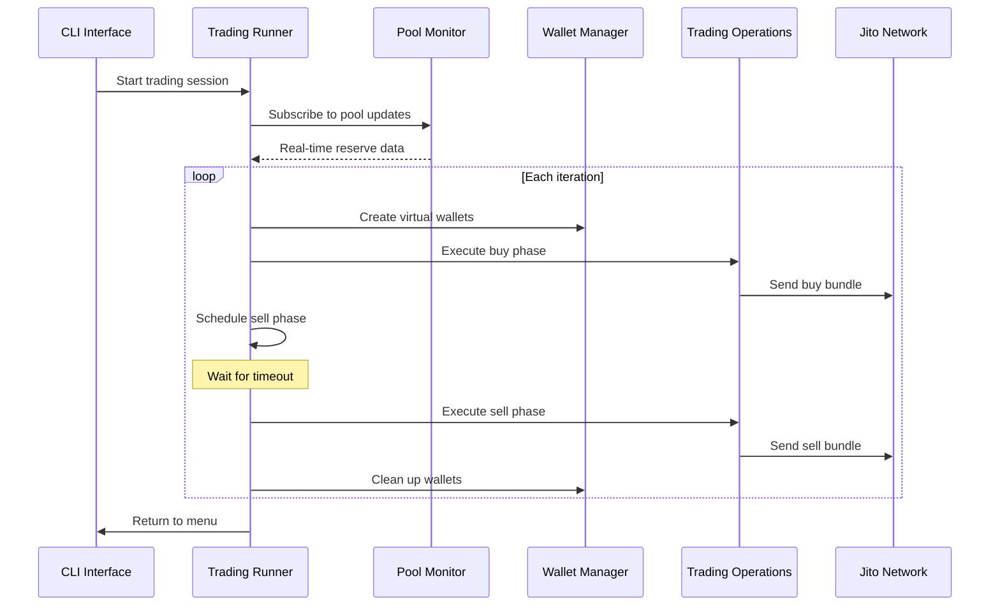

# Virtual Trading for Raydium CPMM

A sophisticated virtual trading system for Raydium Concentrated Liquidity Market
Maker (CPMM) pools that simulates high-frequency trading patterns using multiple
virtual wallets.

## ✨ Features

- **Virtual Wallet Management**: Creates and manages multiple ephemeral wallets
  for trading
- **Buy-Then-Sell Strategy**: Executes buy transactions followed by automated
  sell transactions after a configurable timeout
- **Flexible Pricing Strategies**: Supports fixed and random pricing with
  per-signer customization
- **Real-time Pool Monitoring**: Monitors pool reserves in real-time using
  WebSocket subscriptions
- **Bundle Optimization**: Uses Jito bundles for atomic transaction execution
- **Automatic Cleanup**: Handles wallet funding, refunds, and resource cleanup
  automatically

## 🏗️ Architecture

The package is organized into specialized modules:

```
src/
├── constants.ts          # Configuration constants
├── types.ts             # Type definitions
├── pool-monitor.ts      # Real-time pool monitoring
├── wallet-manager.ts    # Virtual wallet operations
├── trading-operations.ts # Buy/sell transaction logic
├── runner.ts           # Main orchestrator
├── validation.ts       # Input validation schemas
└── index.ts           # CLI command interface
```

### Module Responsibilities

- **PoolMonitor**: Subscribes to token account changes and tracks pool reserves
- **WalletManager**: Creates virtual wallets, handles funding and refunds
- **TradingOperations**: Executes buy and sell phases with bundle optimization
- **VirtualWalletTradingRunner**: Orchestrates the entire trading flow

## 🚀 Usage

### CLI Interface

```bash
npm run build
node dist/index.js virtual-trading
```

### Interactive Configuration

The CLI will prompt for:

1. **Pool Address**: Raydium CPMM pool to trade against
2. **Number of Wallets**: 1-4 virtual wallets per iteration
3. **Pricing Strategy**:
   - Fixed: Same price for all wallets
   - Random: Different random price per wallet
4. **Price Parameters**: Amount (fixed) or min/max range (random)
5. **Jito Tip**: SOL amount for bundle priority
6. **Execution Parameters**: Number of loops and interval between iterations
7. **Sell Timeout**: Delay before executing sell transactions

### Programmatic Usage

```typescript
import { createVirtualWalletTradingRunner } from '@solana-kit-bot/raydium-virtual-trading'
import { createFixedPriceStrategy } from '@solana-kit-bot/core'

const runner = createVirtualWalletTradingRunner(
  context,
  {
    pool: 'PoolAddressHere',
    wallets: 3,
    tip: 10000000n, // 0.01 SOL in lamports
    loops: 5,
    interval: 30000, // 30 seconds
    timeout: 5000, // 5 seconds
    strategy: 'fixed',
    amount: 0.001, // 0.001 SOL per trade
  },
  createFixedPriceStrategy(0.001),
  raydiumClient
)

await runner.setup()
await runner.execute(context)
```

## 📊 Trading Flow



## 🔧 Configuration

### Environment Variables

```bash
# Optional: Custom RPC endpoints
SOLANA_RPC_URL=https://api.mainnet-beta.solana.com
SOLANA_WS_URL=wss://api.mainnet-beta.solana.com

# Optional: Jito endpoints
JITO_BLOCK_ENGINE_URL=https://ny.mainnet.block-engine.jito.wtf
```

### Validation Schema

All inputs are validated using Zod schemas:

```typescript
// Example validated configuration
{
  pool: string,           // Valid Solana address
  wallets: 1-4,          // Integer between 1 and 4
  tip: bigint,           // Minimum 0.000001 SOL
  loops: number,         // Non-negative integer
  interval: number,      // Milliseconds between iterations
  timeout: number,       // Milliseconds before sell
  strategy: 'fixed' | 'random',
  amount?: number,       // For fixed strategy
  min?: number,          // For random strategy
  max?: number           // For random strategy
}
```

## 💡 Pricing Strategies

### Fixed Price Strategy

All wallets use the same amount per trade:

```typescript
{
  strategy: 'fixed',
  amount: 0.001  // 0.001 SOL per wallet
}
```

### Random Price Strategy

Each wallet uses a random amount within the specified range:

```typescript
{
  strategy: 'random',
  min: 0.0005,   // Minimum 0.0005 SOL
  max: 0.002     // Maximum 0.002 SOL
}
```

The random strategy provides metadata to the price calculation:

```typescript
// Available in price strategy context
metadata: {
  signerIndex: number,    // 0-based wallet index
  signerId: string,       // Wallet public key
  totalSigners: number    // Total number of wallets
}
```

## ⚡ Performance Optimizations

### Bundle Optimization

- Groups all transactions into atomic bundles
- Reduces network overhead and improves execution speed
- Uses Jito's priority fee system for faster inclusion

### Parallel Operations

- Creates multiple wallets concurrently
- Subscribes to pool updates asynchronously
- Processes price calculations in parallel

### Memory Management

- Cleans up subscriptions and timeouts automatically
- Removes completed trades from active tracking
- Optimizes RxJS observable chains

## 🛡️ Safety Features

### Automatic Refunds

- Returns unused SOL from virtual wallets to main wallet
- Accounts for transaction fees in refund calculations
- Handles failed transactions gracefully

### Resource Cleanup

- Cancels pending sell operations on shutdown
- Closes WebSocket subscriptions properly
- Clears all timeouts and intervals

### Error Handling

- Validates all inputs before execution
- Provides detailed error messages
- Continues execution if individual trades fail

## 🔍 Monitoring and Logging

### Structured Logging

```typescript
// Example log output
[14:22:39] [TRADING] 📈 Ví 1: giá=37888, mua=37888, nhận=0
[14:22:39] [TRADING] 📈 Đã gửi bundle mua cho lần lặp 1 với 4 ví
[14:22:44] [TRADING] 📈 Đã gửi bundle bán cho trade-1-1753082559898 với 4 ví
```

### Trade Tracking

- Each trade gets a unique identifier
- Tracks signer addresses and amounts
- Monitors pending sell operations
- Provides completion status

## 📈 Use Cases

### Market Making Simulation

Simulate multiple market participants with different trading patterns:

```typescript
// Simulate 4 traders with random amounts
{
  wallets: 4,
  strategy: 'random',
  min: 0.0001,
  max: 0.01,
  loops: 50,
  interval: 10000  // Every 10 seconds
}
```

### Volume Generation

Create consistent trading volume:

```typescript
// Fixed volume every 30 seconds
{
  wallets: 2,
  strategy: 'fixed',
  amount: 0.005,
  loops: 0,        // Infinite
  interval: 30000
}
```

### Arbitrage Testing

Test arbitrage opportunities with quick buy-sell cycles:

```typescript
// Fast arbitrage simulation
{
  wallets: 1,
  strategy: 'fixed',
  amount: 0.1,
  timeout: 1000,   // Sell after 1 second
  interval: 5000   // New trade every 5 seconds
}
```

## 🧪 Testing

### Unit Tests

```bash
npm run test
```

### Integration Tests

```bash
npm run test:integration
```

### Load Testing

```bash
npm run test:load
```

## 📝 API Reference

### VirtualWalletTradingRunner

Main class that orchestrates virtual trading operations.

#### Methods

- `setup()`: Initialize pool monitoring and fetch pool keys
- `execute(context)`: Run the complete trading session
- `executeIteration(context, iteration)`: Execute a single buy-sell cycle
- `cleanup()`: Clean up resources and cancel pending operations

### PoolMonitor

Monitors real-time pool reserve changes.

#### Properties

- `baseReserve`: Current base token reserve amount
- `quoteReserve`: Current quote token reserve amount

#### Methods

- `subscribeToPoolUpdates(context, poolKeys)`: Start monitoring
- `cleanup()`: Stop monitoring and clean up

### TradingOperations

Handles buy and sell transaction execution.

#### Methods

- `executeBuyPhase(...)`: Create and execute buy transactions
- `executeSellPhase(...)`: Create and execute sell transactions

### WalletManager

Manages virtual wallet lifecycle.

#### Methods

- `createVirtualWallets(count)`: Create multiple virtual wallets
- `createFundingBundle(payer, recipients)`: Create funding transaction
- `createRefundInstruction(wallet, payer)`: Create refund transaction

## 🤝 Contributing

1. Fork the repository
2. Create a feature branch
3. Make your changes
4. Add tests for new functionality
5. Run the test suite
6. Submit a pull request

## 📄 License

This package is part of the Solana Kit Bot project and follows the project's
licensing terms.

## 🔗 Related Packages

- `@solana-kit-bot/core`: Core framework and base classes
- `@solana-kit-bot/provider`: Solana RPC and WebSocket providers
- `@solana-kit-bot/raydium-cpmm`: Raydium CPMM client library

---

For more information, visit the
[Solana Kit Bot Documentation](https://github.com/your-org/solana-kit-bot).
